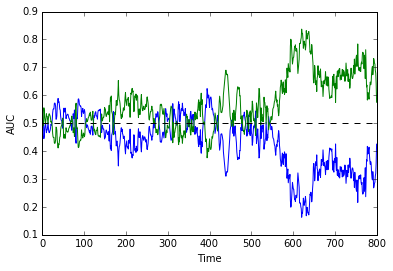
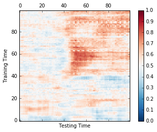
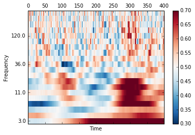
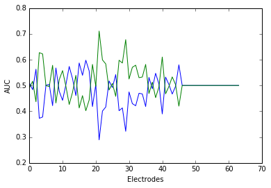
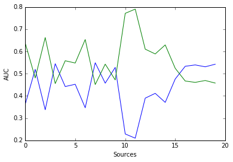
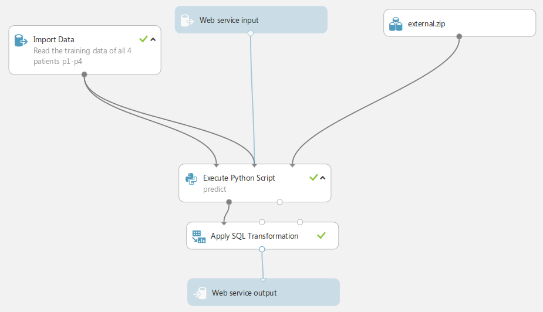

# Cortana ECoG Decoding Challenge: 3rd position

This is to briefly explain how I approached Cortana's decoding challenge organized on the Microsoft Azure ML plateform.

# Data

The aim is to discriminate two classes of multivariate signals, recorded with electro cortico-graphy.

We had access to 4 implanted patients, each presented with 200 images of faces (category 1) or houses (category 2). The private dataset was 40+60 trials invisible to us.

# Forewords

Surprisingly, the solution that worked best on the private dataset was the first of my four attempts, which actually mainly consisted in testing the Azure platform... So least is to say that I got lucky to reach the 3rd position in this challenge...

My intuition is that this solution worked best because it was the only one used multiple, stacked/bagged classifiers, which tend to be robust to heterogeneities between the training and the tested datasets. I suspect that the private dataset suffers from different noise sources than the test dataset (e.g. the bad electrodes may be different between the train and test data, which is actually expected with ECoG).

To minimize my efforts, I mainly use open-source code:
* [MNE-Python](https://github.com/mne-tools/mne-python): an open source package dedicated to the analysis of brain signals for preprocessing.
* [Scikit-Learn](https://github.com/scikit-learn/scikit-learn): the well-known package for 'simple' machine learning.
* [pyRiemann](https://github.com/alexandrebarachant/pyRiemann): the toolbox of Alexandre Barachant, the currently undefeated winner of the decoding competitions related to time-resolved brain signals. It has a bunch of smart tricks to exploit Riemannian geometrical features.

The few enhancements that I had to code for this challenge are or will soon be merged in the corresponding repositories.


# Features selection

* Noise: the two main sources of noise in ECoG are 1) channel-specific, and 2) common noise across channels. Most multivariate analyses that take multiple channels into account (e.g. logistic regression) are very likely to be robust to these two noise sources, because common noise tends to be orthogonal to the signal in high dimensional signal, and channel specific noise quickly get disregarded with regularization.

* Subject specific: ECoG are generally highly specific to each subject. Furthermore, the number of trials was actually pretty low. Across-subjects generalizations and/or data enhancement were therefore unlikely to be easily applicable in this case.

* Preprocessing: should have been None: for these kind of relatively low dimensional recordings (64 electrodes), my experience is that data cleaning is never as efficient as using pipelines that are intrinsically robust to the kind of noise we're dealing with. However, in this first attempt, I had used low-pass filters for evoked responses and some time frequency decompositions for induced responses. My other solutions, that worked much better on the training set did not have any preprocessing.

* Data mining: To get a rough idea of what do expect, I first applied [search light analyses](http://www.ncbi.nlm.nih.gov/pmc/articles/PMC3988828/) in the time, time-frequency and channel domains. The general motive is to "triangulate" the information with simple sub-analyses. This approach is mainly useful when dealing with larger datasets, but since ECoG varies greatly across labs, I thought it could give me a quick intuition of what to expect.

# Search light in the time dimension

A search light in time consists in iteratively applying an estimator over one or several dimension(s) of the data array. In this case we can roll a logistic regression across all electrodes on each time point separately.


```python
# Let's load the data of one subject
%matplotlib inline
import matplotlib.pyplot as plt
from pandas import read_csv
from externals.transformers import *
from externals.mne.decoding import SearchLight
from base import *
csv = read_csv('../cortaintelligence/ecog_train_with_labels.csv')

# Let's just plot the result for the first subject
X, y, _, _ = get_data(csv, patient=0)  # X.shape = (n_epochs, n_chan, n_time), y.shape(n_epochs)

# As a first data mining step, let's just split the data into two sets:
train, test = range(len(X) // 2), range(len(X) // 2, len(X))

# Define a scorer for multiple dimensions:
def scorer_auc(y_true, y_pred):
    """Compute AUC for each dimension"""
    from sklearn.metrics import roc_auc_score
    dims = y_pred.shape
    y_pred = y_pred.reshape(len(y_pred), -1)
    auc = list()
    for ii in range(y_pred.shape[1]):
        auc.append(roc_auc_score(y_true, y_pred[:, ii]))
    return np.reshape(auc, dims[1:])
```


```python
# Define a simple search light over the time dimension:
sl = SearchLight(LogisticRegression(), n_jobs=-1)
y_pred = sl.fit(X[train], y[train]).predict_proba(X[test])
scores = scorer_auc(y[test], y_pred)
fig, ax = plt.subplots(1)
ax.plot(scores)
ax.axhline(.5, color='k', linestyle='--', label='chance')
ax.set_xlabel('Time')
ax.set_ylabel('AUC')
plt.show()
```





For this subject, the decoding performance seems to rise from ~t=500.

# Temporal Generalization

To assess whether the corresponding event related potential (ERP) is stable across time, or weather it reflects a spread of activations across different neural sources, we can apply [temporal generalization](http://www.sciencedirect.com/science/article/pii/S1364661314000199)). This is important to check the extent to which the data is sparse in source space.

To go faster we'll decimate the data by 4 in the time dimension.


```python
# pipeline parameters
decim = slice(400, None, 4)
sl = GeneralizationLight(LogisticRegression(), n_jobs=-1)

# Fit and score
y_pred = sl.fit(X[train, :, decim], y[train]).predict_proba(X[test, :, decim])
scores = scorer_auc(y[test], y_pred[..., 1])

# pplot
fig, ax = plt.subplots(1)
im = ax.matshow(scores, cmap='RdBu_r', vmin=0, vmax=1, origin='lower')
plt.colorbar(im)
ax.set_xlabel('Testing Time')
ax.set_ylabel('Training Time')
plt.show()
```





For this subject, the upper left red square indicates that the ERP is stable over time. This suggests that 1) we shouldn't apply high pass filter and 2) we can apply low pass filter to remove some noise.


# Search light in the time frequency domain

Doing a search light in the time frequency domain is a bit more computationally expensive. To be able to do this on a laptop, we can apply a dimensionality reduction using the [Xdawn algorithm](http://ieeexplore.ieee.org/stamp/stamp.jsp?arnumber=4760273), which is basically a PCA of the average evoked responses.

I can also add some baseline and padding preprocessing steps to minimize border artefacts introduced by the time frequency decomposition.


```python
frequencies = np.logspace(.5, 2.5, 20)
sl_tf = make_pipeline(
    Baseliner(),
    FlatChannelRemover(),
    Xdawn(10, estimator='oas'),
    TimePadder(1500),
    TimeFreqDecomposer(sfreq=1000, frequencies=frequencies,
                       n_cycles=5, decim=slice(1500, -1500, 2), n_jobs=-1),
    Reshaper([10 * 2, -1]),
    SearchLight(LogisticRegression(), n_jobs=-1),
)
# fit/predict
y_pred = sl_tf.fit(X[train], y[train]).predict_proba(X[test])
# score
scores = scorer_auc(y[test], y_pred[..., 1])

# plot
fig, ax = plt.subplots(1)
im = ax.matshow(scores.reshape(20, -1), vmin=.3, vmax=.7,
                aspect='auto', cmap='RdBu_r', origin='lower')
ax.set_yticks(range(0, 20, 5))
ax.set_yticklabels(np.round(frequencies[range(0, 20, 5)]))
ax.set_xlabel('Time')
ax.set_ylabel('Frequency')
plt.colorbar(im)
plt.show()
```





This particular subject is dominated by an evoked response (the lowest frequencies are best decoded), but seems to be some weak oscillatory activity in the beta band (~10 - 30 Hz).

# Search light in the electrode dimension

In principle, ECoG could capture spatially sparse signals. To assess the amount of information carried by each channel independently, we can apply a search light over the electrode dimension.


```python
frequencies = np.logspace(.5, 2.5, 20)
sl_chan = make_pipeline(
    Reshaper(transpose=[0, 2, 1]),  # Search light over channels instead of time
    SearchLight(LogisticRegression(), n_jobs=-1))

# fit/predict
y_pred = sl_chan.fit(X[train], 1.*y[train]).predict_proba(X[test])

# score
scores = scorer_auc(y[test], y_pred)

# plot
fig, ax = plt.subplots(1)
im = ax.plot(scores)
ax.set_xlabel('Electrodes')
ax.set_ylabel('AUC')
plt.show()
```





The signal may be a bit sparse in the channel dimension. To see whether the signal is sparse in the source space, we can re-apply the Xdawn trick, and apply a search light in the corresponding 'source' space.


```python
sl_chan = make_pipeline(
    Baseliner(),
    FlatChannelRemover(),
    Xdawn(10, estimator='oas'),
    Reshaper(transpose=[0, 2, 1]),  # Search light over channels instead of time
    SearchLight(LogisticRegression(), n_jobs=-1))

# fit
sl_chan.fit(X[train], y[train])
# predict
y_pred = sl_chan.predict_proba(X[test])
# score
scores = scorer_auc(y[test], y_pred)

# plot
fig, ax = plt.subplots(1)
im = ax.plot(scores)
ax.set_xlabel('Sources')
ax.set_ylabel('AUC')
plt.show()
```





the couple of picks seem to suggest that most of the signal comes a few set of sources per condition.

Overall we see with a search light approach that the data seems to be:
    * dense in electrode space
    * sparse in source space
    * dominated by an evoked response
    * have a slight induced response around 20 Hz

When applied to each patient separately, we see that the variation of the oscillatory patterns vary.

Now we can just build a transformer/estimator that exploit each of these features.

# Evoked classifiers


```python
transform_gat = make_pipeline(
    FlatChannelRemover(),
    Baseliner(),
    TimePadder(400),
    Filterer(sfreq=1000, l_freq=None, h_freq=20, n_jobs=n_jobs),
    TimeSelector(slice(800, -400, 20)),
    Xdawn(15, estimator='oas'),
    GeneralizationLight(force_predict(SVC(probability=True)), n_jobs=-1),
    Reshaper(), LogisticRegression()
)  # Best classifier

transform_xdawn = make_pipeline(
    FlatChannelRemover(),
    Baseliner(),
    TimePadder(400),
    Filterer(sfreq=1000, l_freq=None, h_freq=20, n_jobs=n_jobs),
    TimeSelector(slice(800, -400, 10)),
    Xdawn(10, estimator='oas'),
    Reshaper(), LogisticRegression()
    )

```

# Induced classifiers


```python
transform_tf = make_pipeline(
    FlatChannelRemover(),
    Baseliner(),
    Xdawn(10, estimator='oas'),
    TimePadder(1500),
    TimeFreqDecomposer(sfreq=1000, frequencies=np.logspace(.5, 2.5, 20),
                       decim=slice(1500, -1500, 2), n_jobs=n_jobs),
    Reshaper(), LogisticRegression()
)

transform_psd = make_pipeline(
    FlatChannelRemover(),
    Baseliner(),
    TimePadder(400),
    Xdawn(20, estimator='oas'),
    PSDEstimator(sfreq=1000, fmax=200, n_jobs=n_jobs),
    Reshaper(), LogisticRegression()
)
```

Time frequency decomposition is not necessarily ideal, because it supposes solving the sources first. Instead we decode in tangent space directly, after a covariance preprocessing. This classifiers uses Alex Barachant's toolbox:


```python
transform_cov = make_pipeline(
    FlatChannelRemover(),
    ERPCovariances(estimator='oas'),
    TangentSpace(),
    Reshaper(), LogisticRegression()
)
```

Finally, we can stack and bag these different classifiers. Here is a possible way of doing it. Most likely, this isn't a very smart one...


```python
pipe = make_pipeline(
    Reshaper(),
    BaggingClassifier(make_pipeline(
        Reshaper([64, 800]),
        CustomEnsemble([
            make_pipeline(transform_xdawn),
            make_pipeline(transform_tf),
            make_pipeline(transform_gat),
            make_pipeline(transform_psd),
            make_pipeline(transform_cov),
            ]),
        LogisticRegression()
    )))
```

# Take home

Overall, the classifiers described above are very likely to be suboptimal. Other tricks based on the signal derivative, connectivity effects, re-ordering of the trials etc are more than likely to significantly improve the results, but would have needed a bit more work. Still, the search-light approach has the advantage of simplifying and understanding the data while avoiding overfitting.

It is important to underline that the present data is uncommon both from a machine learning and a neuroscience point of view:
* it seems that Miller et al used a pseudo-random design with a fixed random seed, which makes the order of the trials extremely predictable. I believe that because of this issue, they had to re-shuffle the data a posteriori, which presumably explains why we only have access to 400 ms after stimulus onset, although it is very common to have >800 ms effects for face versus house responses.
* the testing data is very likely to be significantly different from the training set. This makes the modeling rather hard for non-neuroscientists, because we must inject a lot of a priori into the analysis in order to guess the kind of features that will be robust between the training and the testing datasets.

# Run the analysis on Azure

* Download the present repository
* zip `externals/` and upload the file `external.zip` as a new dataset onto the Azure platform.
* Create a new experiment with the following architecture:

* In the 'Execute Python Script' box, copy/paste the content of `base.py`.
* In the 'Apply SQL Transformation', copy/paste
```
select PatientID, Stimulus_ID,
    cast("Scored Labels" as INTEGER) as "Scored Labels"
from t1;
```
* Run, save and deploy.
